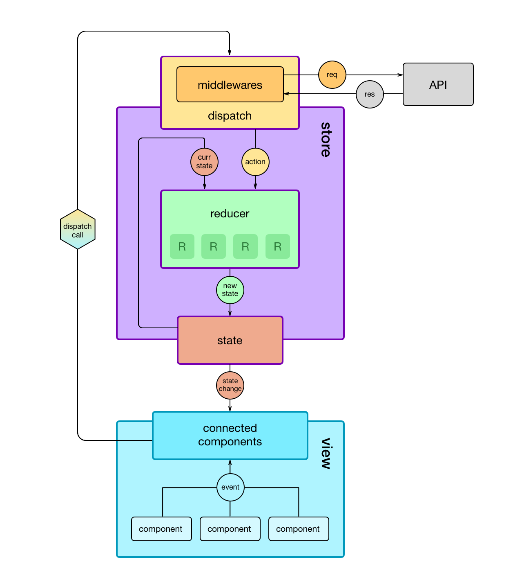

# CPHB Events - Frontend


## Index

1. [Getting Started](#getting-started-anchor)
2. [Overview](#overview-anchor)
3. [Directory Structure](#dir-structure-anchor)
4. [Application Structure](#app-structure-anchor)


## [Getting Started](#getting-started-anchor)

#### Prerequisites

A working knowledge of JavaScript, in particular ES6/7 to take advantage of new language features. You will need `node` and `npm` on your computer.

Highly reccommended but not neccessary for development: [React Dev Tools](https://github.com/facebook/react-devtools) and [Redux Dev Tools](https://github.com/zalmoxisus/redux-devtools-extension). Both are available for installation as browser extensions.

#### Installation

Clone the Git repository to your computer.

```
git clone https://github.com/cgrycki/coph-event-frontend.git
```

Change directories into the repository.

```
cd 'coph-events-frontend`
```

Install the development packages from NPM.

```
npm install --save --save-dev
```

Start the development server

```
npm run start
```

#### Usage

Navigate to the dev site in a local browser while dev server is running.

```
http://localhost:3000 (in Chrome, etc) 
```

You can speed up development by logging into the dev site, as the authentication will cross over to localhost. That is after you authenticate with the dev server, the cookie will also authenticate `localhost` requests.


## [Overview](#overview-anchor)


## [Directory Structure](#dir-structure-anchor)

```
cphb-events-frontend/
├── docs/                             Documentation, pictures
├── public/                           index.html, ico, manifest.json
├── src/                            
│   ├── actions/                      Action creators used to mutate state
│   ├── assets/                       index.css: styles for top level/common components
│   │
│   ├── components                    React: APPLICATION VIEW
│   │   ├── Calendar/                 Calendars: Stand-alone, dashboard, and form
│   │   ├── common/                   Shared components: popup, Navigation Bar, Page Breadcrumbs, Page
│   │   ├── Dashboard/                User Dashboard
│   │   ├── Diagram/                  Floorplan Diagram + utils
│   │   ├── EventPage/                View Event Page
│   │   ├── Form/                     Event creation form
│   │   ├── About.js                  About page
│   │   ├── App.js                    Application wrapper
│   │   ├── Home.js                   Home page
│   │   └── TestComponent.js          Stub component for testing
│   │
│   ├── constants/                    Defines variables used in multiple places
│   ├── reducers/                     Functions that accept actions and mutate state
│   ├── store/                        Redux: APPLICATION DATA
│   ├── utils/
│   │   ├── BussinessRequirements.js  Form validation class
│   │   ├── Counter.js                Furniture Item counter class
│   │   ├── date.utils.js             Date variables + helper functions
│   │   ├── param.utils.js            Input validation functions, used by BusinessReqs
│   │   ├── scaleToDimensions.js      Helper function scaling points to a given {width, height}.
│   │   ├── scaleToFloorplan.js       Helper function scaling points to standard floorplan dimensions.
│   │   └── Schedule.js               Date/Time validation class, used by BusinessReqs.
│   │
│   └── index.js                      Application entry point
|
├── .gitignore
├── .env                              Environment file, ignored by Git
├── package.json                      Dependencies, scripts
├── package-lock.json
├── README.md
└── sample.env                        .env without sensitive information

```


## [Application Structure](#app-structure-anchor)

Our application is split into the following features:
  * *application* - Application level information like `logged_in` or `is_admin`
  * *diagram* - Floorplan information, containing geometric data (`width`/`height`) or furniture data (`items[]` or default layouts)
  * *events* - User's event information. Each event is comprised of `info` (form field) and `layout` (furniture) data.
  * *form* - Holds the current event being created by the user. Also contains error information
  * *rooms* - MAUI Rooms, retrieved from our backend. Each room has a name, number, and featureList.
  * schedules - ASTRA events

A picture is worth a thousand words, here's a screenshot of our Redux store from `redux-dev-tools`:


## Links

- JavaScript
  * ES6/7
  * Babel
  * NPM
- React, Redux, and Ecosystem
  * **[React-Redux Architecture](https://medium.com/mofed/react-redux-architecture-overview-7b3e52004b6e)** (start here)
  * [React Docs](https://reactjs.org/docs/getting-started.html)
  * [Redux Docs](https://redux.js.org/)
- Fabric (Microsoft Office Interface)
  - [Fabric Github](https://github.com/OfficeDev/office-ui-fabric-react)
  - [Fabric React Components](https://developer.microsoft.com/en-us/fabric#/components)
  - [Fabric Styles](https://developer.microsoft.com/en-us/fabric#/styles)
- Routing
  * [React Router GitHub/Documentation](https://github.com/ReactTraining/react-router) -- For routing in single page applications
  * [`connected-react-router` GitHub/Documentation](https://github.com/supasate/connected-react-router) -- For keeping Redux store and react routes in sync.
- Canvas (Floorplan)
  * [KonvaJS documentation](https://konvajs.github.io/docs/index.html)
  * [React-Konva documentation](https://konvajs.github.io/docs/react/)


## Reference

*Redux Lifecycle*, visual example of actions, reducers, and middlewares:

